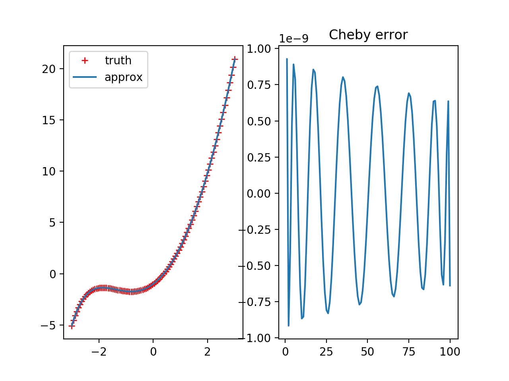
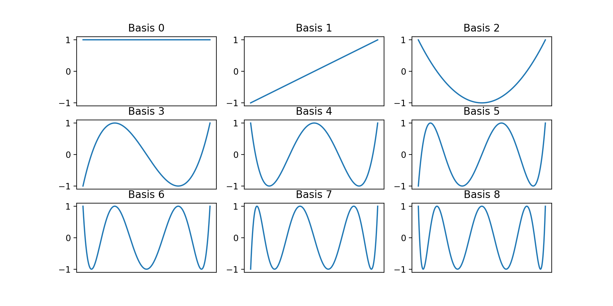
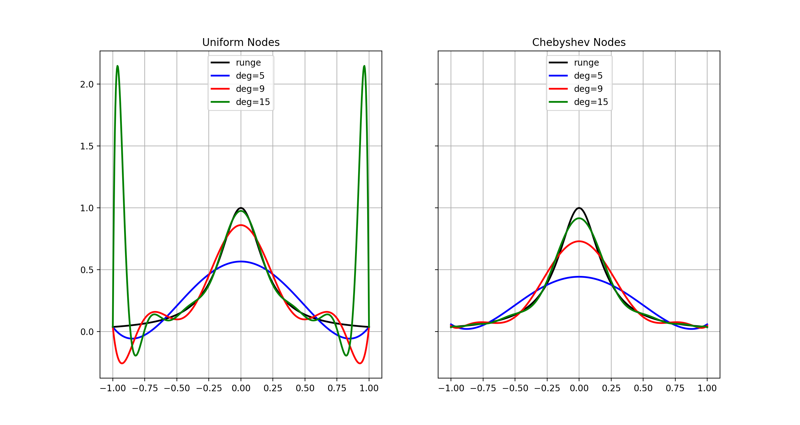
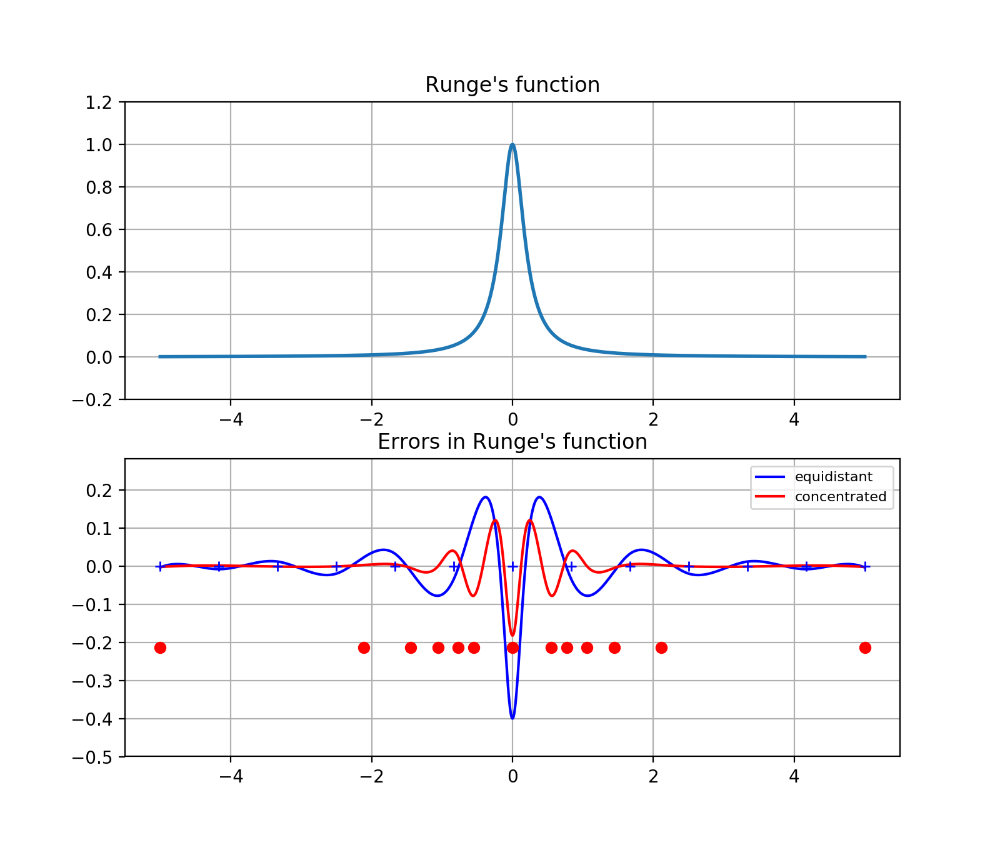
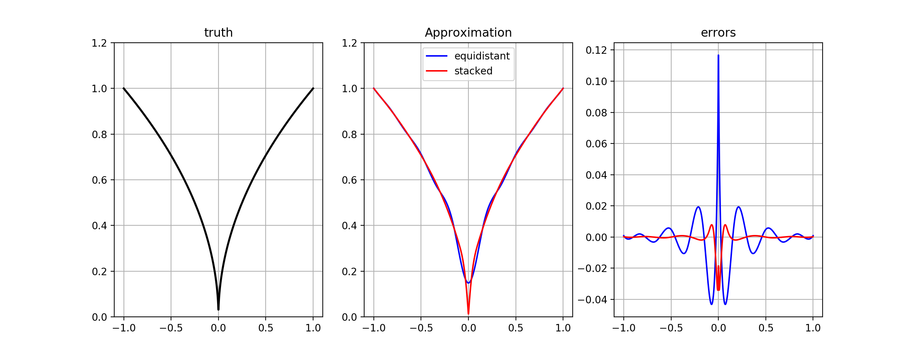

# Function Approximation Homework

[](https://travis-ci.org/ScPo-CompEcon/HWfuncapprox)

## Solutions

### Q1

  

### Q3

  

### Q4

  


  

### Q5

  


## Solutions Branch: How to get this branch

* you need to add this repo as a new `remote` on your computer
* go to the location of the repo on your computer
* do this:

```bash
# add a new remote repository called upstream:
git remote add upstream https://github.com/ScPo-CompEcon/HW-funcapprox.git

# next, get all branches on that remote
git fetch upstream

# finally, to see the code on that branch, check it out:
git checkout solution
```


## License

Please observe that this repo is part of the [Sciences Po CompEcon Organisation](https://github.com/ScPo-CompEcon) and therefore subject to the license detailed at the bottom of [The Syllabus repo](https://github.com/ScPo-CompEcon/Syllabus).
